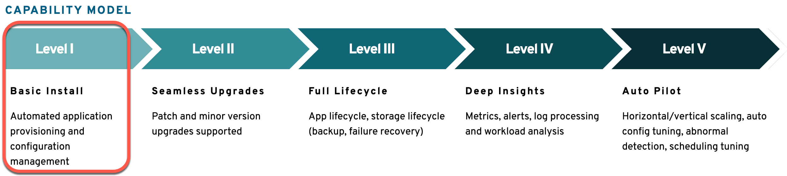

# Operator Framework Ansible Training

### Introduction

In this training you will automate the deployment of an `Hello World!` application to OpenShift, with an `Hello World` operator.

The automation of your simple operator will contain:

* the deployment of the application 
    * Create deployment
    * Create service
    * Create route
      * Therefor we will collect application domain information

Your operator will have capability **Level 1** as you see in the image below.

_Note:_ The image resource you can find on the [Operator Framework: What?](https://operatorframework.io/what/) page.

### Estimated time and level

|  Time | Level |  
| - | - | 
| 60 min | beginner to intermediate  | 

> _Note:_ The installation of all prerequistes isn't included.

### Objectives

This training will show you how to setup a development environment and deploy your first Operator written in Ansible. 

Upon completing this training you will learn the following:

* Setup Ansible Operator Development Environment
* Create Operator Scaffolding and [Custom Resource Definition (CRD/RD)](https://docs.openshift.com/container-platform/4.5/rest_api/extension_apis/customresourcedefinition-apiextensions-k8s-io-v1.html)
* Test and Debug Operators
* Read parameter inputs from CRs into Ansible facts
* Read and create k8s objects using the k8s Ansible Module
* Deploy Application

### Prerequisites

* A fedora 30 or higher system with access to the Internet
* OpenShift 4.x Cluster environment and a cluster admin account

It would be good if you are basicly familar with ...

* ... [Podman](https://podman.io/) or [Docker](https://www.docker.com/get-started)
* ... using container registries like [Quay.io](https://quay.io/) 
* ... Handle `YAMLs`
* ... deployments of containers to [RedHat OpenShift](https://www.openshift.com/)

### Technology Used

* [Ansible](https://www.ansible.com/)
* [Operator Framework](https://operatorframework.io/)

Additional information: These tools needed installed on your local machine:

* [Python](https://www.python.org/)
* [Podman](https://podman.io/) or [Docker](https://www.docker.com/get-started)
* curl
* [IBM Cloud CLI](https://cloud.ibm.com/docs/cli?topic=cli-getting-started) (depending on your cloud provider)
* [OpenShift CLI (oc)](https://docs.openshift.com/container-platform/4.5/welcome/index.html)
* [Kubernetes CLI (kubectl)](https://kubernetes.io/docs/reference/kubectl/kubectl/)
* [GO](https://golang.org/)
* [make](https://en.wikipedia.org/wiki/Make_(software))
* [0perator SDK](https://sdk.operatorframework.io/) using [Ansible](https://www.ansible.com/)

### Credits

* [Keith Tenzer](http://keithtenzer.com)
* [Thomas Südbröcker](https://twitter.com/tsuedbroecker)

