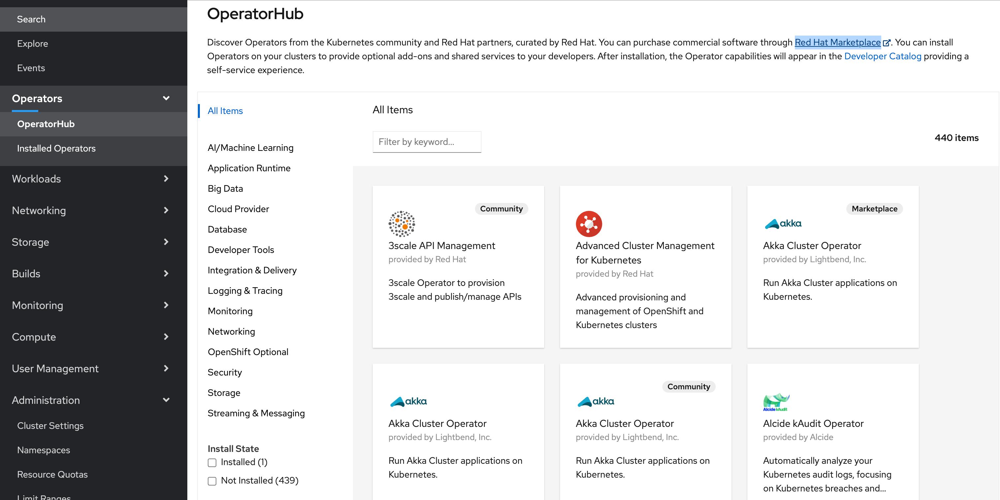

# Operator Framework and Ansible Hands-on Workshop

### Introduction

In this workshop you will automate the deployment of an `Hello World!` application to OpenShift, with an `Hello World` operator, implemented with [Ansible](https://www.ansible.com/).

Your first simple operator will do for you the automates of the creation of :

  * a deployment
  * a service
  * a route
    * Therefor it needs to collect the application domain information

Your operator will have some of the capabilities in **Level 1** as you see in the image below.

_Note:_ The image resource you can find on the [Operator Framework: What?](https://operatorframework.io/what/) page.

This is the definition for Level 1 from the [Operator Framework](https://operatorframework.io/operator-capabilities/)

>Features
>
>Installation Of The Workload
>
>* Operator deploys an Operand or configures off-cluster resources
>
>* Operator waits for managed resources to reach a healthy state
>
>* Operator conveys readiness of application or managed resources to the user leveraging the status block of the Custom Resource

>Configuration Of The Workload
>
>* Operator provides configuration via the spec section of the Custom Resource
>
>* Operator reconciles configuration and updates to it with the status of the managed resources

### Objectives

This workshop will show you how to setup a development environment and deploy your first Operator written in Ansible. 

Upon completing this workshop you will learn the following:

* Setup Ansible Operator Development Environment
* Create Operator Scaffolding and [Custom Resource Definition (CRD/RD)](https://docs.openshift.com/container-platform/4.5/rest_api/extension_apis/customresourcedefinition-apiextensions-k8s-io-v1.html)
* Test and Debug Operators
* Read parameter inputs from [Custom Resource Definition (CRD/RD)](https://docs.openshift.com/container-platform/4.5/rest_api/extension_apis/customresourcedefinition-apiextensions-k8s-io-v1.html) into [Ansible facts](https://docs.ansible.com/ansible/latest/user_guide/playbooks_vars_facts.html)
* Read and create k8s objects using the [k8s Ansible Module](https://docs.ansible.com/ansible/latest/collections/community/kubernetes/k8s_info_module.html)
* Deploy Application

### Estimated time and level

|  Time | Level |  
| - | - | 
| 60 min | beginner to intermediate  | 

> _Note:_ The installation of all prerequistes isn't included.

### Prerequisites

* A **[fedora](https://fedoraproject.org/) 30** or higher **system** (not a container image) with access to the Internet
* OpenShift 4.x Cluster environment and a cluster admin account

It would be good, if you are basicly familar with ...

* ... [Podman](https://podman.io/) or [Docker](https://www.docker.com/get-started)
* ... using container registries like [Quay.io](https://quay.io/) 
* ... handle `YAMLs`
* ... deployments of containers to [RedHat OpenShift](https://www.openshift.com/)

### Technology/Frameworks Used

* [Ansible](https://www.ansible.com/)
* [Operator Framework](https://operatorframework.io/)
* [Ansible Runner](https://github.com/ansible/ansible-runner)

_Additional information:_ 

Following tools are needed to be installed on your local machine:

* [Python](https://www.python.org/)
* [Podman](https://podman.io/) or [Docker](https://www.docker.com/get-started)
* [curl](https://curl.se)
* [IBM Cloud CLI](https://cloud.ibm.com/docs/cli?topic=cli-getting-started) (depending on your cloud provider)
* [OpenShift CLI (oc)](https://docs.openshift.com/container-platform/4.5/welcome/index.html)
* [Kubernetes CLI (kubectl)](https://kubernetes.io/docs/reference/kubectl/kubectl/)
* [GO](https://golang.org/)
* [make](https://en.wikipedia.org/wiki/Make_(software))
* [0perator SDK](https://sdk.operatorframework.io/) using [Ansible](https://www.ansible.com/)

### Credits

* [Keith Tenzer](http://keithtenzer.com) (creater of the initial version of the workshop)
* [Ross Cruickshank](https://www.linkedin.com/in/ross-cruickshank) (Thanks, for testing the worshop on ["IBM Cloud Open Labs"](https://developer.ibm.com/openlabs/openshift) and for your valuable feedback)
* [Thomas Südbröcker](https://twitter.com/tsuedbroecker)

### Additional resources

YouTube "How it does work?":

* [Building Kubernetes Operators with the Operator Framework and Ansible (Keith Tenzer)](https://youtu.be/5XZZxhwb_xs)
* [Kubernetes Operators Explained](https://youtu.be/i9V4oCa5f9I)
* [What is Ansible?](https://youtu.be/fHO1X93e4WA)
* [Operators on OpenShift Container Platform 4.x](https://youtu.be/JMrxPyv9nxQ)

Operator Resources:

* [Operator SDK](https://sdk.operatorframework.io/)
* [Operator Hub (OpenShift operators)](https://operatorhub.io/?category=OpenShift+Optional)
* [Operator Hub (IBM operators)](https://operatorhub.io/?keyword=IBM)

Internal OperatorHub in your RedHat OpenShift cluster.

