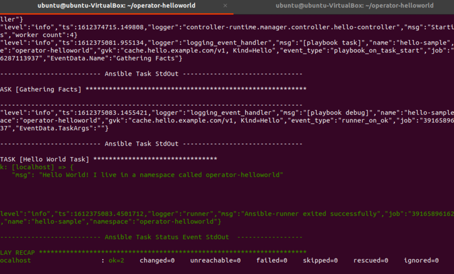

# Exercise 1

In this exercise you will complete the following:

* Create Operator scaffolding in Ansible
* Add a simple debug print statement to the operator Ansible role
* Update the operator Custom Resource (CR) and add a parameter to toggle the print statement
* Test the operator using the ansible-runner

### Step 1: Open your OpenShift web console and copy the login command

* Select `Copy Login Command`


* Press `Display Token`


* Copy `Log in with this token`


* Insert in your terminal session

```sh
oc login --token=7DMj4CRxuUCzXXXXXXXXXX --server=https://XXXXX.com:30596
```

* Verify your login

Example output:


### Step 2: Create a new OpenShift project

```sh
oc new-project operator-helloworld
```

Example output:


### Step 3: Create Operator Scaffolding

Using the operator-sdk, create the scaffolding for your new operator. 

The operator-sdk will generate an Ansible `role`, create a new `custom resource definition (CRD)` and all the necessary `k8s objects` to install the operator. This is a two step process. First initialize and then create API.

```sh
mkdir operator-helloworld
```

```sh
cd operator-helloworld
```

```sh
operator-sdk init --plugins=ansible --domain=hello.example.com
```

The image below show the created folders and files.


```
operator-sdk create api --group cache --version v1 --kind Hello --generate-role
```

### Step 4: Create [Custom Resource Definition (CRD)](https://docs.openshift.com/container-platform/4.5/rest_api/extension_apis/customresourcedefinition-apiextensions-k8s-io-v1.html)

The `operator-sdk` will generate a Custom Resource Definition (CRD).

> The Custom Resource Definition (CRD) will `extend` the k8s API and allow users to `interact` with the Operator through the API. 

Here we will install Custom Resource Definition (CRD) in the current project `operator-helloworld`.

```sh
make install
```

Example output:


_Note:_ To inspect what happens during the `install`, just open the `Makefile`.

```sh
nano Makefile
```
Example output:


### Optional Step 4.1: Inspect the created `Custom Resource Definition (CRD)` in your cluster

* Open OpenShift web console and select `Administration -> Custom Resource Definitions` and insert `hello` into the search field.


* Press `Hello` and you see the details of the Custom Resource Definitions.


### Step 5: Add Print Task to Operator Role

The operator framework implements Ansible roles. By default it will create a single role but you can certainly have many roles. Roles are mapped to the API endpoint of the CRD in the `watches.yaml` file. In this case we will be adding a print statement that will print some debug when a parameter toggle_message is set to true to the role.

* Open the `./watches.yaml` file and inspect the content.

```
nano watches.yaml
```

```yml
# Use the 'create api' subcommand to add watches to this file.
- version: v1
  group: cache.hello.example.com
  kind: Hello
  role: hello
# +kubebuilder:scaffold:watch
```

* Open the `./roles/hello/tasks/main.yml` file and insert the print statement.

```
nano roles/hello/tasks/main.yml
```

The content to add to the `main.yml`

```yml
---
# tasks file for hello
- name: Hello World Task
  debug:
    msg: "Hello World! I live in a namespace called {{ ansible_operator_meta.namespace }}"
  when: toggle_message
```

### Step 6: Add parameter to the Operator Custom Resource

Here we will add the `toggle_message` parameter to the CR. Any parameters under the CR spec are automatically visible in Ansible. 

This is how you get input from your users. In addition as you may have noticed you can access CR metadata using the `ansible_operator_meta` parameter in ansible. In the above example that is the name os the namespace.

```sh
nano config/samples/cache_v1_hello.yaml
```

Content to add to `cache_v1_hello.yaml` file. `foo: bar` will be replaced with `toggle_message: true`.

```yml
apiVersion: cache.hello.example.com/v1
kind: Hello
metadata:
  name: hello-sample
spec:
  toggle_message: true
```

### Step 7: Run Operator using ansible-runner

Now that we have implemented some tasks and our parameter we can run ther Operator locally using the `ansible-runner` to test it. 

```sh
ansible-operator run local
```

Example output:


### Step 8: Create a hello custom resource

Open another terminal and create the CR in your OpenShift cluster. 
Once the CR is created, the Operator will execute the Ansible role tasks and print our debug message.

```sh
oc create -f config/samples/cache_v1_hello.yaml
```
Example output second terminal:


Example output first terminal: 

```sh
TASK [Hello World Task] ********************************
ok: [localhost] => {
    "msg": "Hello World! I live in a namespace called operator-helloworld"
}
```


