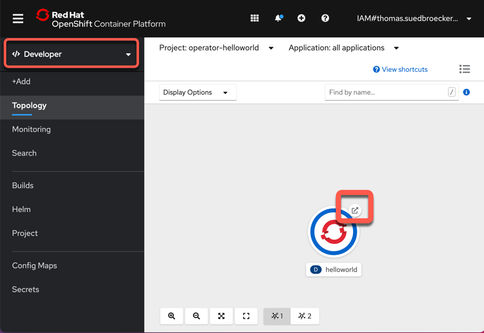

# Exercise 2

In this exercise you will complete the following:

* Expand [Ansible role](https://docs.ansible.com/ansible/latest/user_guide/playbooks_reuse_roles.html) to get the cluster domain name and save that in a fact
* Expand the [Ansible role](https://docs.ansible.com/ansible/latest/user_guide/playbooks_reuse_roles.html) to deply a helloworld application
* Test the operator using the [ansible-runner](https://github.com/ansible/ansible-runner)
* Deploy operator to namespace so it runs without the [ansible-runner](https://github.com/ansible/ansible-runner)

### Step 1: Update Ansible role to get cluster domain name and save as a fact

Here we will learn to use the `k8s Ansible` module to gather information we want to use later in our automation. In this case the cluster domain name. Append the following tasks to the Ansible role.

We going to use following [Asible](https://docs.ansible.com/) `keywords:

* [k8s_info](https://docs.ansible.com/ansible/latest/collections/community/kubernetes/k8s_info_module.html)
* [set_fact](https://docs.ansible.com/ansible/latest/collections/ansible/builtin/set_fact_module.html)
* debug

```sh
nano roles/hello/tasks/main.yml
```

Content to addd to the `main.yml`:

```yml
- name: Get Application Domain from Cluster Ingress
  k8s_info:
    api_version: config.openshift.io/v1
    kind: Ingress
    name: cluster
  when: application_domain is undefined
  register: ingress

- name: Set Application Domain
  set_fact:
    application_domain: "{{ ingress.resources[0].spec.domain }}"
  when: application_domain is undefined

- name: Print application domain
  debug:
    msg: "Application domain is {{ application_domain }}"
```

### Step 2: Run Operator using ansible-runner

Each time Operator is started or something changes with our CRD the Ansible role will run and our changes will of course be executed.

```sh
ansible-operator run local
```

In the Example output you see the execution of the predefined tasks in the `main.yml`.

* `Gathering Facts` 

```sh
--------------------------- Ansible Task StdOut -------------------------------
TASK [Gathering Facts] *********************************************************
-------------------------------------------------------------------------------
{"level":"info","ts":1612430621.8876169,"logger":"logging_event_handler","msg":"[playbook debug]","name":"hello-sample","namespace":"operator-helloworld","gvk":"cache.hello.example.com/v1, Kind=Hello","event_type":"runner_on_ok","job":"3916589616287113937","EventData.TaskArgs":""}
```

* `Hello World Task`

```sh
--------------------------- Ansible Task StdOut -------------------------------
TASK [Hello World Task] ******************************** 
ok: [localhost] => {
    "msg": "Hello World! I live in a namespace called operator-helloworld"
}
"level":"info","ts":1612430621.8958986,"logger":"logging_event_handler","msg":"[playbook task]","name":"hello-sample","namespace":"operator-helloworld","gvk":"cache.hello.example.com/v1, Kind=Hello","event_type":"playbook_on_task_start","job":"3916589616287113937","EventData.Name":"hello : Get Application Domain from Cluster Ingress"}
```

* `hello : Get Application Domain from Cluster Ingress`

```sh
-------------------------- Ansible Task StdOut -------------------------------
TASK [hello : Get Application Domain from Cluster Ingress] *********************
task path: /home/ubuntu/operator-helloworld/roles/hello/tasks/main.yml:8
"level":"info","ts":1612430622.4394364,"logger":"proxy","msg":"Skipping cache lookup","resource":{"IsResourceRequest":false,"Path":"/version","Verb":"get","APIPrefix":"","APIGroup":"","APIVersion":"","Namespace":"","Resource":"","Subresource":"","Name":"","Parts":null}}
....
```

* `Print application domain`

```sh
--------------------------- Ansible Task StdOut -------------------------------
TASK [Print application domain] ******************************** 
ok: [localhost] => {
    "msg": "Application domain is rh-workshop-..000.us-south.containers.appdomain.cloud"
}
level":"info","ts":1612430626.1358507,"logger":"runner","msg":"Ansible-runner exited successfully","job":"3916589616287113937","name":"hello-sample","namespace":"operator-helloworld"}
```

* `PLAY RECAP`

```sh
--------------------------- Ansible Task Status Event StdOut  -----------------
PLAY RECAP *********************************************************************
localhost                  : ok=5    changed=0    unreachable=0    failed=0    skipped=0    rescued=0    ignored=0   
```

### Step 3: Update Ansible role to deploy hellowoworld application

Now we will learn to use the `k8s` Ansible module to deploy an application. 
We will deploy a helloworld application that prints to `STDOUT`. 
Notice the route is using the cluster domain we gathered in the previous step. In this step we will create a deployment, service and route for our helloworld application. 
Append the following tasks to the Ansible role.

```sh
nano roles/hello/tasks/main.yml
```

* We use `k8s:definition:` to define the `Service`, `Deployment` and `Route`

```yml
- name: Deploy helloworld service
  k8s:
    definition:
      apiVersion: v1
      kind: Service
      metadata:
        namespace: "{{ ansible_operator_meta.namespace }}"
        labels:
          app: helloworld
        name: helloworld
      spec:
        ports:
        - port: 8080
          targetPort: 8080
        selector:
          app: helloworld
          name: helloworld
      status:
        loadBalancer: {}

- name: Deploy helloworld app
  k8s:
    definition:
      kind: Deployment
      apiVersion: apps/v1
      metadata:
        name: helloworld
        namespace: "{{ ansible_operator_meta.namespace }}"
        labels:
          app: helloworld
      spec:
        replicas: 1
        strategy:
          type: RollingUpdate
        selector:
          matchLabels:
            app: helloworld
        template:
          metadata:
            labels:
              app: helloworld
              name: helloworld
          spec:
            containers:
            - image: openshift/hello-openshift
              imagePullPolicy: Always
              name: helloworld
              readinessProbe:
                httpGet:
                  path: /
                  port: 8080
                initialDelaySeconds: 60
                periodSeconds: 10
                timeoutSeconds: 60
              livenessProbe:
                httpGet:
                  path: /
                  port: 8080
                initialDelaySeconds: 120
                periodSeconds: 10
              ports:
              - containerPort: 8080
            restartPolicy: Always
        triggers:
        - type: ConfigChange

- name: Deploy helloworld route
  k8s:
    definition:
      apiVersion: route.openshift.io/v1
      kind: Route
      metadata:
        namespace: "{{ ansible_operator_meta.namespace }}"
        annotations:
          openshift.io/host.generated: "true"
        name: helloworld
      spec:
        host: "hello-{{ ansible_operator_meta.namespace }}.{{application_domain}}"
        to:
          kind: Service
          name: helloworld
          weight: 100
        port:
          targetPort: 8080
        wildcardPolicy: None
```

### Step 4: Update role permissions

Since we are creating a `service` and `route` we need to add those permissions to the `hello` role,
to add services so we can create them.

Open the `role.yaml` file. (More about [roles](https://docs.ansible.com/ansible/latest/user_guide/playbooks_reuse_roles.html))

```sh
nano config/rbac/role.yaml
```

Change the permissions.

```yml
##
## Rules for cache.hello.example.com/v1, Kind: Hello
##
  - apiGroups:
      - ""
    resources:
      - secrets
      - pods
      - pods/exec
      - pods/log
      - services
    verbs:
      - create
      - delete
      - get
      - list
      - patch
      - update
      - watch
```

Append also `routes` and `ingress api` groups so we can also manage those objects.

```yml
##
## Rules for cache.hello.example.com/v1, Kind: Hello
##
  ...
  ...
  - apiGroups:
    - ""
    - config.openshift.io
    resources:
    - ingresses
    verbs:
    - create
    - delete
    - deletecollection
    - get
    - list
    - patch
    - update
    - watch
  - apiGroups:
    - ""
    - route.openshift.io
    resources:
    - routes
    - routes/custom-host
    verbs:
    - create
    - delete
    - deletecollection
    - get
    - list
    - patch
    - update
    - watch
```

### Step 5: Run Operator using ansible-runner

This time we should see the application being deployed. 
A single pod should start and a `service/route` should be created.

```sh
ansible-operator run local
```

### Step 6: Test our deployment

To test simply use curl against the route URL. It does take a minute or so to start application.

* pods:

```sh
oc get pods
```

Example output:

```sh
NAME                         READY   STATUS    RESTARTS   AGE
helloworld-f9d964dcc-jgcmn   1/1     Running   0          70s
```
* routes:

```sh
oc get routes
```

Example output:

```sh
NAME         HOST/PORT                                             PATH   SERVICES     PORT   TERMINATION   WILDCARD
helloworld   hello-operator-helloworld.apps.xxxxx.com          helloworld   8080
```

* Invoke `YOUR` URL with curl or just open a browser and insert the URL

```
$ curl http://hello-operator-helloworld.xxxxxx.com
Hello OpenShift!
```

### Optional Step 7: Open the [`Developer perspective`](https://docs.openshift.com/container-platform/4.5/web_console/odc-about-developer-perspective.html) in your RedHat web console

* Select `operator-helloworld` project
* Select `external route` from the `helloworld` pod



* Verify the application in your browser


