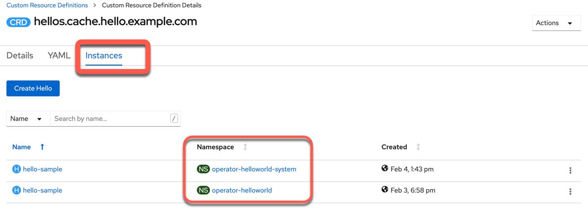

# Exercise 3

In this exercise you will complete the following:

* Create a [Quay.io](https://quay.io/) account
* Build image of our Operator and push it to [Quay.io](https://quay.io/)
* Deploy Operator to OpenShift cluster

### Preview

Here you can see an example deployment of the `HelloWorld operator` we will create in this exercise, by using an existing container image from the [Quay.io](https://quay.io/) container registry and then we create a new `HellowWorld` application using the operator inside your RedHat OpenShift Cluster:

* Deploy operator gif:


* Create HelloWorld app using the operator gif:


### Step 1: Create Quay.io Account

Quay.io us a container registry provided by Red Hat. You can create your own account push container images to it. Each image can be public or private. To make images available to OpenShift you will need to make them public.

Go to [Quay.io](https://quay.io/) and create your own account if you don't have one and then login to [Quay.io](https://quay.io/).

```sh
docker login quay.io
```

### Step 2: Build Operator image and push to quay.io

```sh
sudo make docker-build docker-push IMG=quay.io/ktenzer/operator-helloworld:latest
```

Make the `operator-helloworld` image in your quay.io account public. Logon to quya.io, click on the image. Under `settings (on the left) there is option to make the image public.


### Step 3: Deploy Operator to OpenShift Cluster

By default the operator will be deployed to a project called `operator-helloworld-system`. The operator is called `operator-helloworld-controller-manager`.

```sh
make deploy IMG=quay.io/ktenzer/operator-helloworld:latest
```

As you see in the example output, we create or configure ...

* ... Namespace
* ... Custom resource
* ... [Leader election role](https://docs.openshift.com/container-platform/4.5/operators/operator_sdk/osdk-leader-election.html)
* ... Manager Role
* ... Proxy Role
* ... Metrixs reader
* ... [Leader election role](https://docs.openshift.com/container-platform/4.5/operators/operator_sdk/osdk-leader-election.html) binding
* ... Manager role binding
* ... Proxy role binding
* ... Controller Manager metrics service
* ... Controller Manager

Example output:

```sh
cd config/manager && /home/ubuntu/operator-helloworld/bin/kustomize edit set image controller=quay.io/ktenzer/operator-helloworld:latest
/home/ubuntu/operator-helloworld/bin/kustomize build config/default | kubectl apply -f -
namespace/operator-helloworld-system created
customresourcedefinition.apiextensions.k8s.io/hellos.cache.hello.example.com created
role.rbac.authorization.k8s.io/operator-helloworld-leader-election-role created
clusterrole.rbac.authorization.k8s.io/operator-helloworld-manager-role created
clusterrole.rbac.authorization.k8s.io/operator-helloworld-metrics-reader created
clusterrole.rbac.authorization.k8s.io/operator-helloworld-proxy-role created
rolebinding.rbac.authorization.k8s.io/operator-helloworld-leader-election-rolebinding created
clusterrolebinding.rbac.authorization.k8s.io/operator-helloworld-manager-rolebinding created
clusterrolebinding.rbac.authorization.k8s.io/operator-helloworld-proxy-rolebinding created
service/operator-helloworld-controller-manager-metrics-service created
deployment.apps/operator-helloworld-controller-manager created

```

_Note:_ You can change `project name` by editing the `config/default/kustomization.yaml` file.


* Verify Operator Deployment

```sh
oc get deployment -n operator-helloworld-system
```

Example output:

```sh
NAME                            READY   UP-TO-DATE   AVAILABLE   AGE
helloworld-controller-manager   1/1     1            1           37s
```

_Optional:_ Open your RedHat OpenShift web console select `Developer perspective` and `Topology`. Ensure you are in the `operator-helloworld-system` project.


### Step 4: Deploy a `Helloworld Application` using Operator

Using the Operator we just deployed into the `operator-helloworld-system` project we will now deploy the application using CR.

* Create the application using the operator

```sh
oc create -f config/samples/cache_v1_hello.yaml -n operator-helloworld-system
```

* Get the deploment information from the project

```sh
oc get deployment -n operator-helloworld-system
```

Example output:

```
NAME                            READY   UP-TO-DATE   AVAILABLE   AGE
helloworld                      1/1     1            1           12m
helloworld-controller-manager   1/1     1            1           12m
```

_Optional:_ Open your RedHat OpenShift web console select `Developer perspective` and `Topology`. Ensure you are in the `operator-helloworld-system` project.


_Optional:_ Open your RedHat OpenShift web console select `Administrator perspective` and `Custom Resource Definition` 

* Search for `Hello` and press CRD `Hello`


Now you see the two two created `hello-sample`s.

* One in the project `operator-helloworld` created the operator running on the local machine
* One in the project `operator-helloworld-system` created by the `helloworld-controller-manager` in the RedHat OpenShift Cluster




### Step 5: Cleanup Application

Removing the CR will delete everything that was created by it `since` the objects are linked to the CR. 

```sh
oc delete hello hello-sample -n operator-helloworld-system
```

Example output:

```sh
hello.cache.hello.example.com "hello-sample" deleted
```

You see there is one remaining.


### Step 6: Verify the operator is remaining in the deployment of the `operator-helloworld-system` project.

```sh
oc get deployment -n operator-helloworld-system
```

Example output:

```sh
NAME                                     READY   UP-TO-DATE   AVAILABLE   AGE
operator-helloworld-controller-manager   1/1     1            1           153m
```

### Step 7: Cleanup Operator

This will remove the Operator, CRD and all the roles.

```sh
make undeploy
```

Example output:

```sh
/home/ubuntu/operator-helloworld/bin/kustomize build config/default | kubectl delete -f -
namespace "operator-helloworld-system" deleted
customresourcedefinition.apiextensions.k8s.io "hellos.cache.hello.example.com" deleted
role.rbac.authorization.k8s.io "operator-helloworld-leader-election-role" deleted
clusterrole.rbac.authorization.k8s.io "operator-helloworld-manager-role" deleted
clusterrole.rbac.authorization.k8s.io "operator-helloworld-metrics-reader" deleted
clusterrole.rbac.authorization.k8s.io "operator-helloworld-proxy-role" deleted
rolebinding.rbac.authorization.k8s.io "operator-helloworld-leader-election-rolebinding" deleted
clusterrolebinding.rbac.authorization.k8s.io "operator-helloworld-manager-rolebinding" deleted
clusterrolebinding.rbac.authorization.k8s.io "operator-helloworld-proxy-rolebinding" deleted
service "operator-helloworld-controller-manager-metrics-service" deleted
deployment.apps "operator-helloworld-controller-manager" deleted
```

### Step 8: Verify the operator is deleted

```sh
oc get deployment -n operator-helloworld-system
```
Example output:

```sh
No resources found in operator-helloworld-system namespace.
```

You can also verify the `Customer Resource Definition` for `hello` in the web console.


**Congrats**, if you got this far you are ready to write your own Operators in Ansible!
