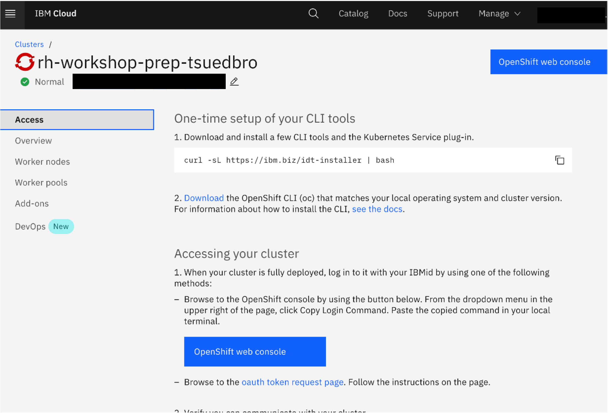

# Install OpenShift Command Line Tools

The OpenShift command line tools ships with oc and kubectl binaries.

[Download](https://cloud.redhat.com/openshift/install) a pre-built release and install the oc as well as kubectl binaries under /usr/bin. You will need to login with your Red Hat account and select the infrastructure provider where your OpenShift cluster is running. Remember to check the permissions and ensure the binaries have execute permission. You can also download command line tools for OpenShift from the OpenShift cluster itself under the question mark by your user in the UI.

### Example information for RedHat OpenShift on IBM Cloud

The access tab you see in the image contain the infromation to setup the local access to your cluster.

> _Note:_ An example link to a mirror to download the [RedHat OpenShift Client Versions for 4.X](https://mirror.openshift.com/pub/openshift-v4/clients/oc/)

